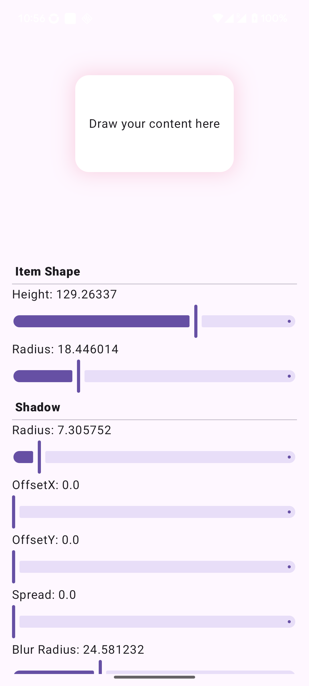

# Compose Shadow Kotlin Extension

A Jetpack Compose Android application that demonstrates a custom shadow modifier extension, providing advanced shadow effects for UI components with real-time customization controls.

## 🎯 Overview

This project showcases a custom `shadow` modifier for Jetpack Compose that goes beyond the standard elevation-based shadows. It provides fine-grained control over shadow properties including blur radius, spread, offset, color, and border radius.

## 📸 Screenshots & Demo

| App Screenshot | Live Demo |
|:---:|:---:|
|  |  |

*The GIF above shows real-time shadow customization with interactive controls for blur radius, offset, spread, color, and border radius.*

## ✨ Features

- **Custom Shadow Modifier**: Advanced shadow implementation using Android's `BlurMaskFilter`
- **Real-time Controls**: Interactive sliders to adjust shadow properties in real-time
- **Color Picker**: RGBA color picker for precise shadow color customization
- **Live Preview**: Instant visual feedback as you adjust shadow parameters
- **Modern UI**: Built with Material Design 3 and Jetpack Compose

### Shadow Properties

- **Border Radius**: Rounded corners for the shadow
- **Blur Radius**: Shadow blur intensity
- **Offset X/Y**: Shadow position offset
- **Spread**: Shadow expansion beyond the original shape
- **Color**: Full RGBA color control
- **Shape Height**: Adjustable content height for testing

## 🚀 Getting Started

### Prerequisites

- Android Studio Hedgehog or later
- Kotlin 2.2.10+
- Android SDK 24+ (minimum)
- Target SDK 34

### Installation

1. Clone the repository:
```bash
git clone https://github.com/yourusername/compose-shadow-kotlin-ext.git
cd compose-shadow-kotlin-ext
```

2. Open the project in Android Studio

3. Sync the project and run on an Android device or emulator

## 🔧 Usage

### Basic Shadow Usage

```kotlin
import com.creative.compose_shadow.shadow.shadow

@Composable
fun MyComponent() {
    Box(
        modifier = Modifier
            .shadow(
                color = Color.Black.copy(alpha = 0.2f),
                borderRadius = 16.dp,
                blurRadius = 8.dp,
                offsetX = 4.dp,
                offsetY = 4.dp,
                spread = 2.dp
            )
            .background(Color.White)
            .padding(16.dp)
    ) {
        Text("Content with custom shadow")
    }
}
```

### Shadow Modifier Parameters

```kotlin
fun Modifier.shadow(
    color: Color = Color.Black,           // Shadow color
    borderRadius: Dp = 0.dp,             // Corner radius
    blurRadius: Dp = 0.dp,               // Blur intensity
    offsetY: Dp = 0.dp,                  // Vertical offset
    offsetX: Dp = 0.dp,                  // Horizontal offset
    spread: Dp = 0.dp,                   // Shadow spread
    modifier: Modifier = Modifier
): Modifier
```

## 🏗️ Architecture

### Project Structure

```
app/src/main/java/com/creative/compose_shadow/
├── MainActivity.kt                    # Main activity with demo UI
├── shadow/
│   ├── Shadow.kt                     # Core shadow modifier implementation
│   └── ShadowUiState.kt             # UI state data class
├── ui/
│   ├── custom/
│   │   ├── AppSlider.kt             # Custom slider component
│   │   ├── ColorPicker.kt           # RGBA color picker
│   │   └── TitleHeader.kt           # Section header component
│   └── theme/                       # Material Design theme
```

### Key Components

- **Shadow Modifier**: Custom Compose modifier using `drawBehind` and Android's `BlurMaskFilter`
- **Interactive Controls**: Real-time sliders for all shadow properties
- **Color Picker**: Component for precise RGBA color selection
- **State Management**: Reactive UI state with Compose's `mutableStateOf`

## 🛠️ Technical Implementation

The shadow effect is implemented using:

- **Canvas Drawing**: `drawIntoCanvas` for low-level graphics operations
- **BlurMaskFilter**: Android's native blur filter for shadow blur effects
- **Framework Paint**: Direct access to Android's Paint API
- **Compose Modifiers**: Clean, reusable modifier chain integration

### Key Features of the Implementation

- **Performance Optimized**: Reuses paint instances and minimizes allocations
- **Stable API**: Marked with `@Stable` for Compose optimization
- **Flexible Parameters**: All shadow properties are customizable
- **Anti-aliased**: Smooth shadow edges with anti-aliasing enabled

## 📱 Demo App Features

The included demo application provides:

- **Live Shadow Preview**: See changes instantly as you adjust parameters
- **Comprehensive Controls**: Sliders for all shadow properties
- **Color Customization**: Full RGBA color picker
- **Shape Controls**: Adjustable content height and border radius
- **Organized UI**: Grouped controls with sticky headers

## 🔄 Recent Updates

- **Kotlin 2.0+ Support**: Updated to use the new Compose Compiler plugin
- **Modern Dependencies**: Latest Compose BOM and Material Design 3
- **Enhanced Performance**: Optimized shadow rendering implementation

## 🤝 Contributing

Contributions are welcome! Please feel free to submit a Pull Request. For major changes, please open an issue first to discuss what you would like to change.

### Development Setup

1. Fork the repository
2. Create your feature branch (`git checkout -b feature/AmazingFeature`)
3. Commit your changes (`git commit -m 'Add some AmazingFeature'`)
4. Push to the branch (`git push origin feature/AmazingFeature`)
5. Open a Pull Request

## 📄 License

This project is licensed under the MIT License - see the [LICENSE](LICENSE) file for details.

## 👨‍💻 Author

**Dan** - *1010 Creative*

- Created: January 27, 2024
- Copyright © 2024 1010 Creative. All rights reserved.

## 🙏 Acknowledgments

- Built with [Jetpack Compose](https://developer.android.com/jetpack/compose)
- Uses [Material Design 3](https://m3.material.io/)
- Inspired by CSS box-shadow properties

---

*For questions or support, please open an issue in the GitHub repository.*
